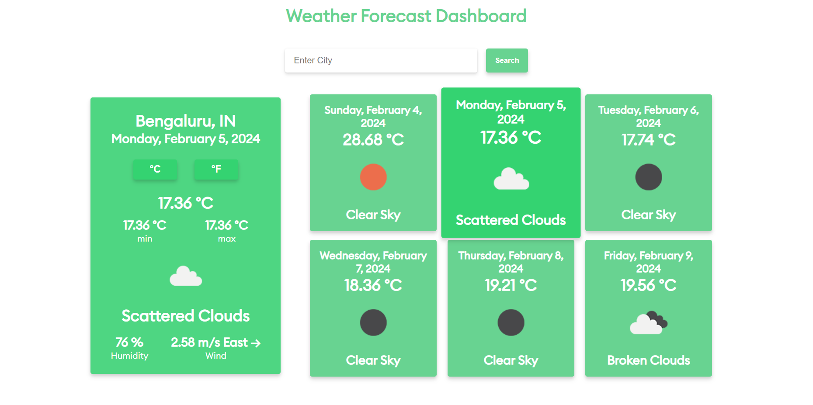

# Weather Forecast Dashboard - [Visit Now](https://weather-forecast-dash.netlify.app/)

Welcome to the Weather Forecast Dashboard project! This application allows users to check the current weather details and 5-day forecast for a selected city. The user can toggle between Celsius and Fahrenheit for temperature units.

## Features

1. **Current Weather Details**

   - Current Temperature
   - Min and Max Temperature
   - Humidity
   - Wind Speed and Direction
   - Weather Description
   - Weather Icon

2. **5-Day Forecast**

   - Date
   - Average Temperature
   - Weather Description
   - Weather Icon

3. **Temperature Units**
   - Toggle between Celsius and Fahrenheit

## Technical Details

- **Tech Stack:** HTML, CSS, JavaScript, ReactJS, OpenWeatherMap API
- **Responsiveness:** The application is responsive and optimized not only for desktop and mobile but for all range of device viewing.
- **User-Friendly:** Intuitive user interface with clear error handling for non-existent city names.
- **Code Quality:** Well-structured, maintainable, and follows best practices.

## Screens

### Desktop View



### Tablet View


### Mobile View


## Installation

1. Clone the repository:

   ```bash
   git clone https://github.com/Abhijitkr/weather-forecast-dashboard.git
   ```

2. Navigate to the directory:

   ```bash
   cd weather-forecast-dashboard
   ```

3. Install dependencies:

   ```bash
   npm install
   ```

4. Don't forget add environment variable file, example provided in the root of the repository (.env.example)

## Usage

1. Start the deployment server

   ```bash
   npm run dev
   ```

2. Open your browser and go to http://localhost:5173

3. Enter the city name in the search bar and explore the weather details!
